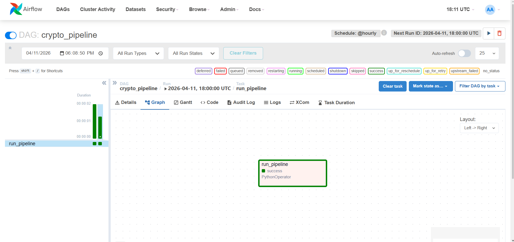
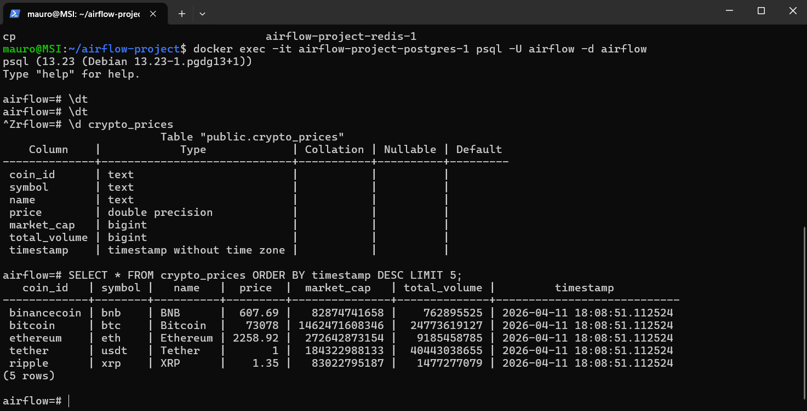

# 🚀 End-to-End Crypto Data Pipeline (Airflow + Docker + PostgreSQL)

## 📌 Overview

This project implements an end-to-end data engineering pipeline that ingests, processes, and stores real-time cryptocurrency market data.

Extracts data from the CoinGecko API, transforms it using Python, and loads it into a PostgreSQL database. Workflow orchestration is managed using Apache Airflow, and the entire system runs in a containerized environment using Docker.

Simulates a production-style ETL workflow with automated scheduling and scalable infrastructure.

---

## 🏗️ Architecture

CoinGecko API → Python (ETL) → PostgreSQL → Airflow → BI Tools

---

## ⚙️ Tech Stack

* Python (pandas, requests, SQLAlchemy)
* Apache Airflow (DAGs, scheduling)
* PostgreSQL
* Docker & Docker Compose
* Power BI (optional)

---

## 🌐 Data Source

This project uses the CoinGecko API to retrieve real-time cryptocurrency market data.

- Endpoint: `/coins/markets`
- Data includes: price, market cap, volume, and asset metadata

Example request:

https://api.coingecko.com/api/v3/coins/markets

---

## 🔄 Pipeline Workflow

### 1. Data Ingestion (Extract)

* Fetches real-time cryptocurrency data from CoinGecko API
* Retrieves metrics such as price, market cap, and volume

### 2. Data Transformation (Transform)

* Converts JSON data into a pandas DataFrame
* Selects relevant columns and renames fields for consistency

### 3. Data Storage (Load)

* Loads structured data into PostgreSQL
* Uses append strategy for incremental data storage

### 4. Workflow Orchestration

* Apache Airflow DAG schedules and executes the ETL process hourly
* Uses PythonOperator to trigger the pipeline functions

---

## 📁 Project Structure

airflow-crypto-pipeline/
│
├── dags/
│   └── crypto_dag.py
│
├── pipeline.py
├── docker-compose.yaml
├── requirements.txt
└── README.md

---

## 🧠 ETL Implementation

The ETL pipeline is implemented in a single Python module:

* extract_data() → retrieves API data
* transform_data() → processes and cleans data
* load_data() → stores data in PostgreSQL
* run_pipeline() → orchestrates the ETL steps

The Airflow DAG imports these functions and executes them as a scheduled workflow.

---

## 📸 Screenshots

### 🔹 Airflow DAG Execution

### 🔹 PostgreSQL Query Output (Pipeline Result)

---

## ▶️ How to Run

### 1. Start Docker

Make sure Docker Desktop is running.

### 2. Start the services

docker compose up -d

Wait ~20–40 seconds until all services are ready.

---

### 3. Access Airflow UI

Open your browser:
http://localhost:8080

Credentials:

* Username: airflow
* Password: airflow

---

### 4. Trigger the pipeline

* Locate DAG: `crypto_pipeline`
* Enable it (toggle ON)
* Click **Trigger DAG**

---

### 5. Verify execution

* Go to **Graph View**
* All tasks should appear **green (successful)**

---

### 6. Query the data in PostgreSQL

Run:

docker exec -it <postgres_container_name> psql -U airflow -d airflow

List tables:
\dt

Query data:
SELECT coin_id, price, market_cap, timestamp
FROM crypto_prices
ORDER BY timestamp DESC
LIMIT 5;

Exit:
\q

---

## 🔄 Pipeline Flow

Docker → Airflow → DAG Execution → PostgreSQL → Query Results

---

## 📊 Output

* Data is stored in PostgreSQL table: crypto_prices
* Includes:

  * coin_id
  * symbol
  * name
  * price
  * market_cap
  * total_volume
  * timestamp

---

## 🔑 Key Features

* Automated ETL pipeline using Apache Airflow
* Real-time data ingestion from CoinGecko API
* Data transformation using pandas
* PostgreSQL data storage
* Containerized architecture with Docker
* Scheduled execution (@hourly)

---

## 🚀 Future Improvements

* Refactor pipeline into modular components (extract / transform / load)
* Add data validation and logging
* Connect to Power BI for visualization
* Deploy to cloud (AWS/GCP)
* Add machine learning model for price prediction

---

## 🧠 What This Project Demonstrates

* ETL pipeline development
* API integration
* Workflow orchestration with Airflow
* Containerized data infrastructure
* Data readiness for analytics and BI

---

## 📬 Contact

Open to opportunities in Data Engineering, Data Science, and Analytics.
